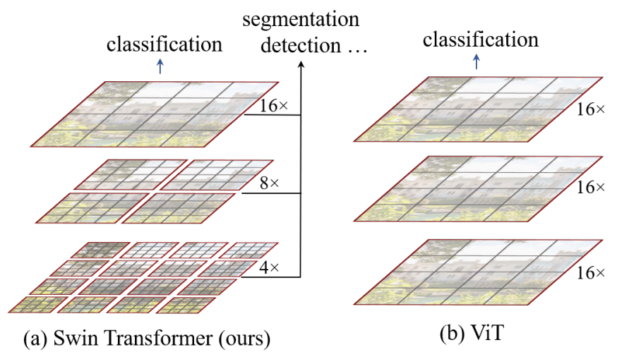
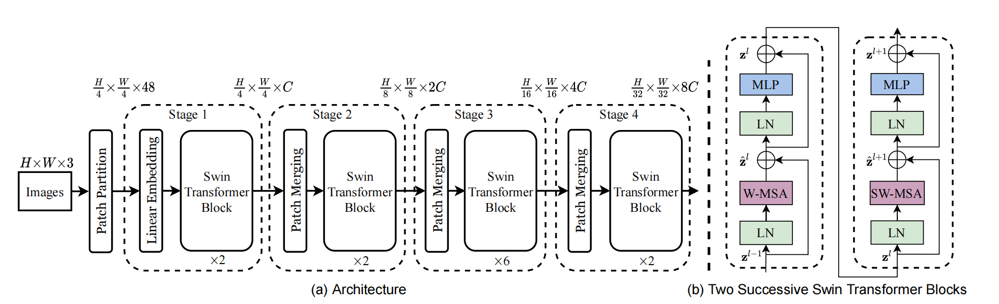
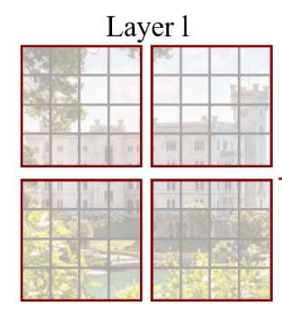
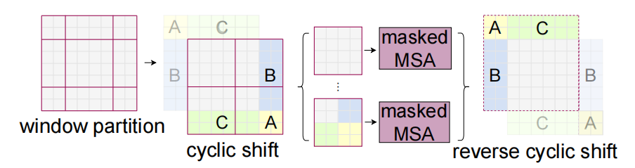
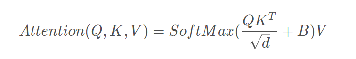
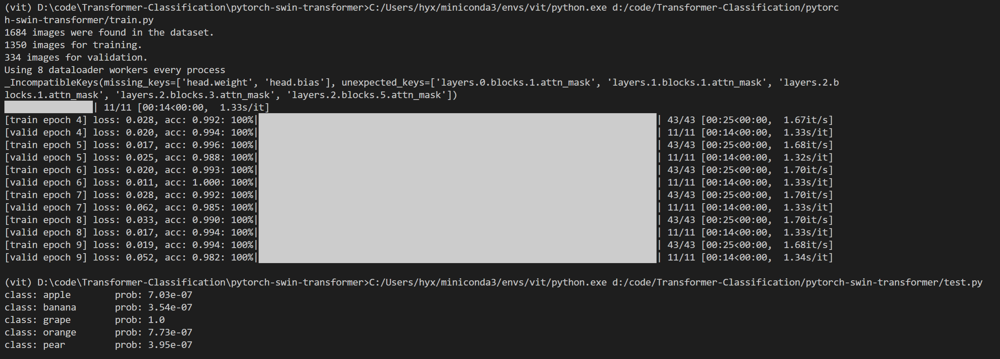
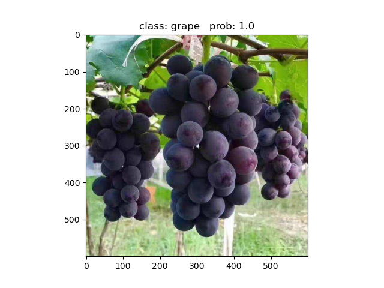

# pytorch-swin-transformer
 复现swin-transformer

## 1、模型结构
vit模型仅仅适用于图像分类任务，而且仅仅使用了16倍下采样。swin-transformer采用了层次化构建方法，比如特征图尺寸中有对图像下采样4倍的，8倍的以及16倍的，这样的backbone有助于在此基础上构建目标检测，实例分割等任务。

整体框架：

这里的Swin Transformer Block中采用W-MSA结构和SW-MSA结构交替使用，且必须成对使用。这样的整体结构非常适合改进做后续目标检测、跟踪等任务。

### 1.1 W-MSA
这就是一种分窗口的多头注意力机制，将特征图划分为一个个窗口，然后分别计算注意力。

### 1.2 SW-MSA
W-MSA的问题在于只能在每个窗口单独计算注意力，而每个窗口之间的信息无法流通。故对窗口进行按规则偏移，交流每个窗口之间的信息，重新计算注意力：

这样又会引入九个窗口，计算太麻烦，因此需要移动这些块，让它们看起来类似W-MSA的结构，即计算四个窗口。计算的时候需要用Mask掩盖不需要的部分。

### 1.3 相对位置索引
引入相对位置偏置B

## 2、实验结果
训练和测试结果

## 3、参考
1、https://blog.csdn.net/qq_37541097/article/details/121119988

2、https://arxiv.org/abs/2103.14030